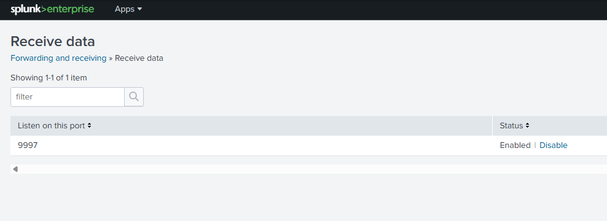

# 2. Splunk SIEM Deployment

## Overview
This section covers the installation and configuration of Splunk Enterprise on the Ubuntu Server. Splunk serves as the SIEM platform for this lab, providing log ingestion, searching, alerting, and dashboard capabilities.

## What is Splunk
Splunk Enterprise is an industry standard SIEM platform used in enterprise SOC environments worldwide. It collects logs from endpoints across a network, indexes them, and provides powerful search and alerting capabilities for threat detection and incident investigation.

## Installation Steps

### Step 1 - Download Splunk Enterprise
Downloaded Splunk Enterprise directly to the Ubuntu Server using wget:

    wget -O splunk-9.4.1-e3bdab203ac8-linux-amd64.deb "https://download.splunk.com/products/splunk/releases/9.4.1/linux/splunk-9.4.1-e3bdab203ac8-linux-amd64.deb"

Command breakdown:
- wget = command line tool for downloading files from the internet
- -O = save the file with the specified filename
- The URL = direct download link from Splunk's official servers

### Step 2 - Install Splunk
Installed the downloaded package using dpkg:

    sudo dpkg -i splunk-9.4.1-e3bdab203ac8-linux-amd64.deb

Command breakdown:
- dpkg = Debian package manager, Ubuntu's built in installer
- -i = install the specified package
- .deb = Debian package format, equivalent to a Windows .exe installer

Splunk installs to /opt/splunk which is the standard Linux location for third party applications.

### Step 3 - Start Splunk and Accept License
Started Splunk for the first time and accepted the license agreement:

    sudo /opt/splunk/bin/splunk start --accept-license

During first startup Splunk prompted for:
- Administrator username creation
- Administrator password creation

### Step 4 - Configure Boot Start
Configured Splunk to start automatically when the server boots:

    sudo /opt/splunk/bin/splunk enable boot-start -user root

Why: A SIEM must run 24/7. If the server reboots and Splunk does not start automatically, logs stop being collected and monitoring gaps are created.

### Step 5 - Configure Receiving Port
Configured Splunk to listen for incoming logs from forwarders on port 9997.

In the Splunk web dashboard:
1. Navigate to Settings
2. Click Forwarding and Receiving
3. Click Configure Receiving
4. Click New Receiving Port
5. Enter 9997
6. Click Save
   

Why: Opening port 9997 in the firewall allows traffic through the operating system, but Splunk also needs to be told to listen and accept that traffic on the same port.

### Step 6 - Verify Splunk is Running

    sudo /opt/splunk/bin/splunk status

Expected output:
- splunkd is running
- splunk helpers are running

## Accessing the Dashboard
Splunk web interface is accessible from any browser on the network at http://10.0.0.x:8000

Log in with the administrator credentials created during installation.

## Key Concepts Learned
- Using wget to download files directly to a Linux server
- Installing .deb packages with dpkg
- Difference between firewall port rules and application port configuration
- Importance of boot start configuration for always-on monitoring
- Splunk's role as a centralized log collection and analysis platform

## Verification
| Check | Command | Expected Result |
|---|---|---|
| Splunk running | sudo /opt/splunk/bin/splunk status | splunkd is running |
| Port listening | sudo ss -tlnp grep 8000 | Port 8000 active |
| Web accessible | Browser to http://10.0.0.x:8000 | Login page loads |

## Next Section
[3. Log Collection Configuration](../3-Log-Collection-Configuration/README.md)
