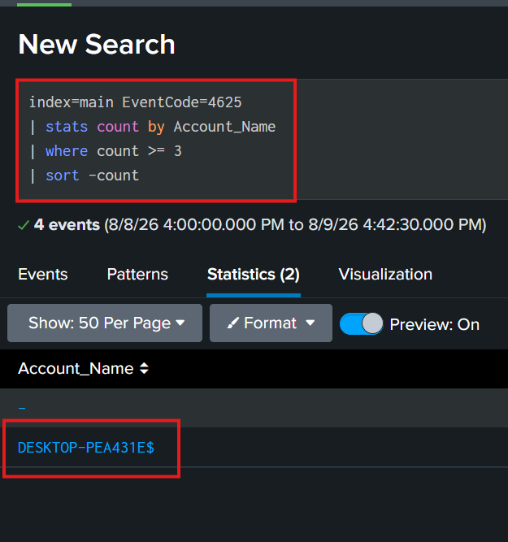
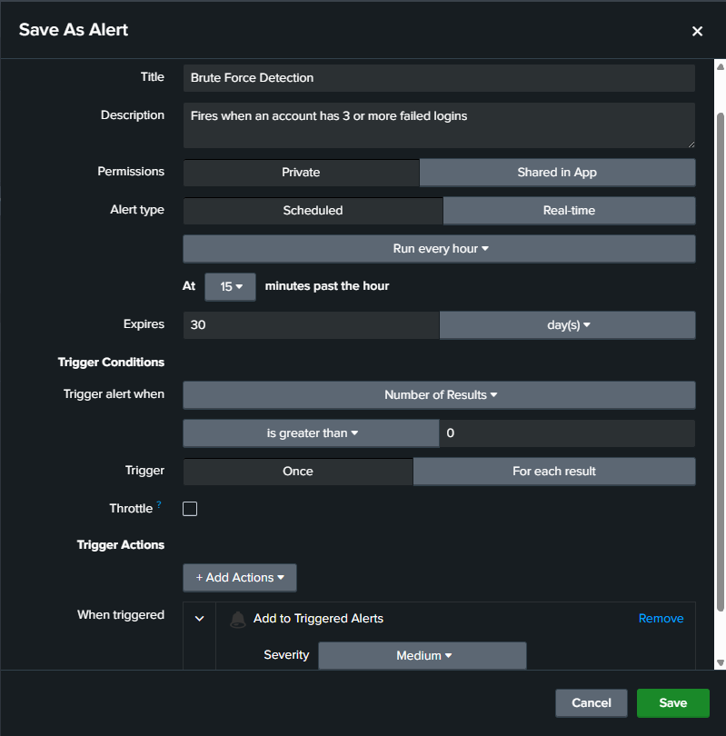

# 4. Alerts and Dashboard Setup

## Overview
After collecting logs from Windows and Linux endpoints
the next step was building automated alerts and a
monitoring dashboard in Splunk. This section covers
the two alerts built to detect real threats and the
SOC monitoring dashboard created to provide continuous
visibility into security activity across the lab.

## Why Alerts and Dashboards Matter
Manually searching through logs every few minutes is not
practical. Alerts automatically notify analysts when
suspicious patterns are detected, while dashboards provide
a live view of security activity across the environment.
Together they allow continuous monitoring without constant
manual effort.

## Alert 1 - Brute Force Detection

### What it Detects
A brute force attack occurs when an attacker uses
automated tools to rapidly try many different passwords
against an account. The key indicator is multiple failed
login attempts in a short period of time.

This alert fires when any account accumulates 3 or more
failed login attempts within a 15 minute window.

### Why This Threshold
The threshold of 3 failed logins was chosen based on
normal activity observed in the lab:
- Under normal usage the monitored Windows PC rarely
  had more than 1 or 2 failed logins
- Setting the threshold at 3 avoids false positives
  from occasional mistyped passwords
- The 15 minute window catches both fast and moderately
  paced attacks

### Testing and Building the Alert
To generate test data, 4 failed logins were intentionally
created on the Windows 11 PC by entering the wrong
password on the lock screen. This produced 4 EventCode
4625 entries in Splunk.

The following search was then built and confirmed working:

    index=main EventCode=4625
    | stats count by Account_Name
    | where count >= 3
    | sort -count

Once confirmed, the search was saved as an alert using
"Save As" then Alert in Splunk.

### Alert Configuration

Because the alert runs on a schedule, it does not fire
instantly. However, the search results confirmed above
proved the detection logic was working correctly before
the alert was saved.

## Alert 2 - Port Scan Detection

### What it Detects
A port scan is when an attacker sends connection attempts 
to many different ports on a target machine to discover 
which services are running. This is typically the first 
phase of an attack known as reconnaissance.

This alert fires when the UFW firewall blocks more than
30 connection attempts from the same source IP within
the alert's configured time range.

### Why This Matters
Detecting reconnaissance early means an attacker can be
identified and blocked before progressing further into
the network. The threshold of 30 blocked connections was
chosen because normal traffic in the lab generates almost
no UFW blocks — any IP hitting 30 blocks in 60 seconds
is almost certainly running an automated scan.

### Building the Alert
The following search was built to detect port scan 
activity using UFW firewall logs:

    index=main sourcetype=ufw "BLOCK"
    | rex field=_raw "SRC=(?<src_ip>\S+)"
    | stats count by src_ip
    | where count > 30
    | sort -count

Once confirmed the search was saved as an alert using
"Save As" then Alert in Splunk.

### Alert Configuration

## SOC Monitoring Dashboard

### Purpose
The SOC monitoring dashboard provides a single screen 
view of security activity across the entire lab 
environment. Instead of running individual searches 
the dashboard displays key security metrics that 
update automatically.

### How the Dashboard Was Built
The dashboard was created in Splunk by:
1. Clicking Dashboards in the top menu
2. Clicking Create New Dashboard
3. Naming it SOC Home Lab Monitor
4. Adding panels one at a time using Add Panel

Each panel runs its own SPL search automatically 
on a set schedule.

### Panel 1 - Failed Login Attempts Over Time

    index=main EventCode=4625
    | timechart span=1h count as "Failed Logins"

A line chart showing failed login attempts over the 
past 7 days. Spikes in this chart immediately indicate 
unusual authentication activity.

How to read it:
- Flat line = normal activity, no failed logins
- Small occasional spikes = mistyped passwords
- Large spike = possible brute force attack
- Sustained high line = active ongoing attack

### Panel 2 - Failed Logins Today

    index=main EventCode=4625
    | stats count as "Total Failed Logins"

Displays a single number showing total failed logins 
today. Gives an analyst an immediate count without 
running any searches manually.

### Panel 3 - Security Events Summary

    index=main EventCode IN (4624, 4625, 4672, 4688)
    | stats count by EventCode
    | eval Event_Type=case(
        EventCode=4624, "Successful Login",
        EventCode=4625, "Failed Login",
        EventCode=4672, "Admin Privileges Assigned",
        EventCode=4688, "New Process Created")
    | table Event_Type, count
    | sort -count

Shows a breakdown of key security events by type. The 
ratio of successful to failed logins is particularly 
valuable for spotting attacks at a glance.

### Panel 4 - Top Accounts with Failed Logins

    index=main EventCode=4625
    | stats count by Account_Name
    | sort -count
    | rename count as "Failed Attempts" Account_Name as "Account"

Shows which accounts are accumulating the most failed 
login attempts. In a brute force attack the targeted 
account will appear at the top with a significantly 
higher count than others.

## Key Concepts Learned
- Building threshold based alerts in Splunk
- Writing SPL searches for threat detection
- Tuning alert thresholds based on baseline activity
- Saving searches as scheduled alerts
- Building multi panel SOC dashboards
- Using timechart to visualize security trends
- The difference between detecting and investigating threats
- How alerts and dashboards reduce manual analyst workload

## Next Section
[5. Attack Simulation](../5-Attack-Simulation/README.md)
