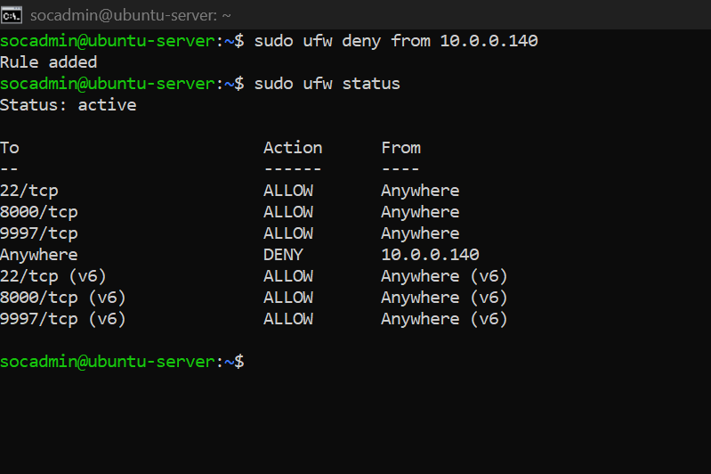
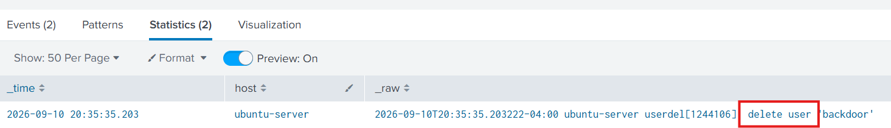

# 5. Attack Simulation

## Overview
Now that the alerts and dashboard are set up the next 
step was to actually test them. A Kali Linux machine 
running on the same internal network (10.0.0.140) was 
used to simulate attacks against the Ubuntu Server 
(10.0.0.26) and Windows PC (10.0.0.220). Since the 
Kali machine is internal the attacking IP will appear 
as a private address in Splunk — simulating a scenario 
where an attacker has already gained a foothold inside 
the network.

Three attacks were performed and investigated:
- SSH brute force against the Ubuntu Server
- Port scan against the Ubuntu Server  
- Brute force against the Windows PC

While the attacker perspective is briefly covered 
for context the primary focus is on what appeared 
in Splunk and how each attack was investigated.

---

## Attack 1 - SSH Brute Force Against Ubuntu Server

### Attacker Side
A wordlist of common passwords was created on the 
Kali machine with the actual account password included 
in the list

Hydra was then used to attempt each password against the SSH 
service on the Ubuntu Server.

    hydra -l socadmin -P passwords.txt ssh://10.0.0.26 -t 4 -V

Command breakdown:
- hydra = the brute force tool
- -l socadmin = the username being targeted
- -P passwords.txt = the password wordlist
- ssh://10.0.0.26 = the target and protocol
- -t 4 = 4 parallel threads
- -V = verbose output showing each attempt

Once Hydra found the correct password it was used 
to SSH directly into the server as the attacker:

    ssh socadmin@10.0.0.26

From there a few commands were run to get a feel 
for the environment:

- whoami
- id
- uname -a
- cat /etc/passwd
- sudo -l

A new backdoor account was then created to simulate 
what an attacker would do to maintain access:

    sudo useradd -m backdoor
    sudo passwd backdoor

---

### Defender Side

#### Discovery
While checking Splunk the following search was run 
against the Ubuntu Server's authentication log:

    index=main sourcetype=linux_secure "Failed password"
    | table _time, host, _raw
    | sort -_time

Setting the time range to "Today" immediately 
pulled up a stream of failed SSH login attempts all 
coming from the same IP address hitting the server 
back to back within seconds. 

#### Checking Triggered Alerts
After seeing the failed logins I navigated to Activity 
then Triggered Alerts. The brute force detection alert 
had already fired — confirming the alert was working 
as expected.

#### Dashboard Overview
Pulling up the dashboard gave a quick visual of what 
was going on:

- Panel 1 had a noticeable spike on the Ubuntu Server
  line showing the sudden jump in failed logins
- Panel 2 showed the failed login count for today
  was higher than usual
- Panel 4 had the socadmin account sitting at the top
  with the most failed attempts

#### Investigation
The next step was checking whether any of those 
attempts actually succeeded:

    index=main sourcetype=linux_secure "Accepted"
    | rex field=_raw "from (?<src_ip>\d+\.\d+\.\d+\.\d+)"
    | where src_ip="10.0.0.140"
    | table _time, host, _raw
    | sort -_time

"Accepted password" from the attacking IP showed up. 
This confirms the attacker got in.

---

Running this search pulled up about 10 failed password 
check entries followed by a new session entry at the 
bottom. This is showing exactly where the failed attempts 
ended and the successful login began.

    index=main sourcetype=linux_secure
    | where src_ip="10.0.0.140" OR _raw LIKE "%socadmin%"
    | table _time, host, _raw
    | sort _time

---

Any sudo commands run were checked:

    index=main sourcetype=linux_secure "sudo" "socadmin"
    | table _time, host, _raw
    | sort _time
    
Sudo activity from the attacker's session showed up, confirming the attacker was running privileged 
commands after gaining access:

---

New user accounts were checked to see if the attacker 
created a backdoor:

    index=main sourcetype=linux_secure "new user"
    | table _time, host, _raw
    | sort _time

A new account had been created. The attacker 
established a backdoor to maintain access even if 
the original credentials were changed.

#### Remediation

**Immediate Actions:**

The backdoor account that was created during the 
attack was removed immediately:

    sudo userdel -r backdoor

This was verified by confirming the account no longer 
appeared in the system:

    cat /etc/passwd | grep backdoor

The attacking IP was then blocked at the firewall 
level to prevent any further access:

    sudo ufw deny from 10.0.0.140
    sudo ufw status

The removal of the backdoor account was also visible 
in Splunk confirming it was captured in the logs:

    index=main sourcetype=linux_secure "delete user"
    | table _time, host, _raw
    | sort -_time

**Hardening**

- Disabled SSH password authentication and switched 
  to key based authentication only

  Why: Instead of a username and password, a cryptographic 
  key file is now required to authenticate. This prevents 
  brute force attacks entirely since there is no password 
  to guess.

1. Generate key pair (Windows PC):

        ssh-keygen -t rsa -b 4096 -f C:\Users\%USERNAME%\.ssh\id_rsa

2. Copy public key to server (Windows PC):

        type C:\Users\%USERNAME%\.ssh\id_rsa.pub | ssh socadmin@10.0.0.26 "mkdir -p ~/.ssh && cat >> ~/.ssh/authorized_keys"

3. Disable password authentication (Ubuntu Server):

        sudo nano /etc/ssh/sshd_config
        sudo nano /etc/ssh/sshd_config.d/50-cloud-init.conf

   Set both files to:
        PasswordAuthentication no

4. Restart SSH (Ubuntu Server):

        sudo systemctl restart ssh

5. Verify password auth is disabled by attempting 
   to connect from the Kali machine using password only:

        ssh socadmin@10.0.0.26

   Should return Permission denied (publickey) 

**Other Recommendations:**
- Install fail2ban to automatically block IPs after 
  repeated failed login attempts
- Restrict SSH access to trusted IP addresses only
- Implement network segmentation to prevent attack 
  machines from directly reaching critical servers
- Consider moving SSH to a non standard port to 
  reduce automated scanning
