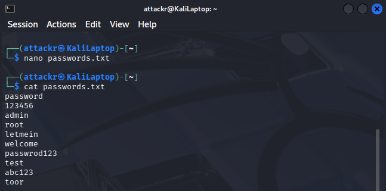
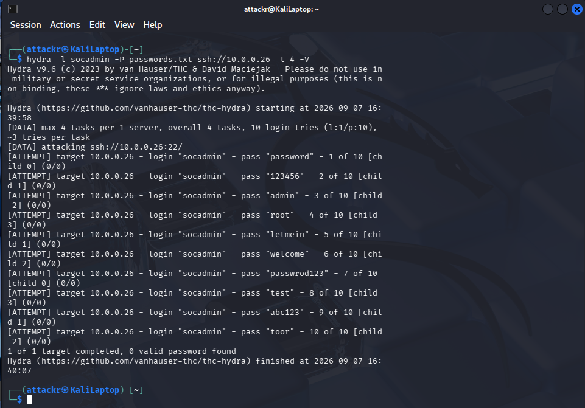
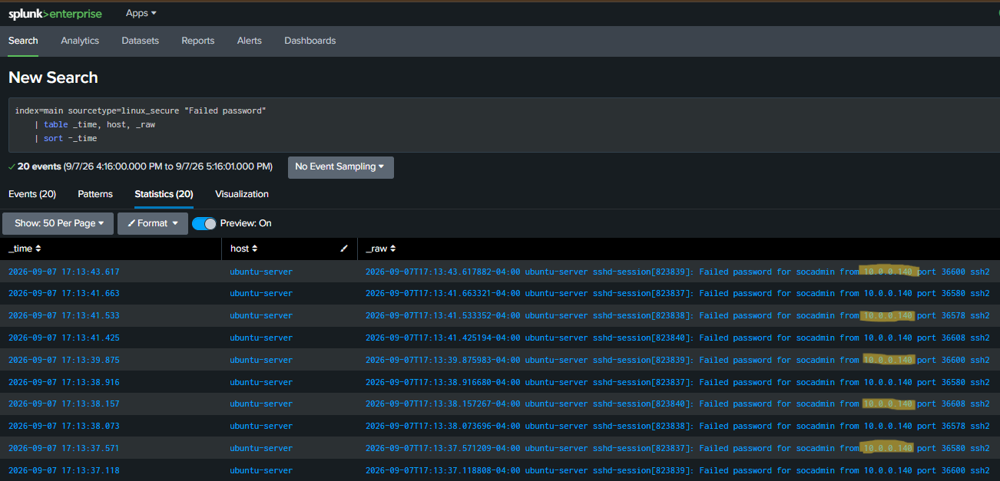
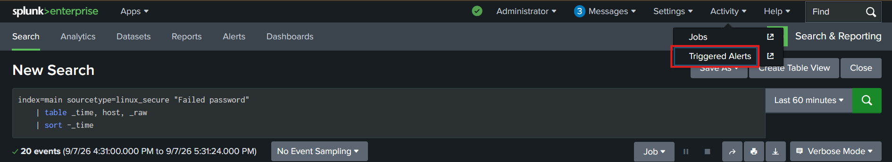
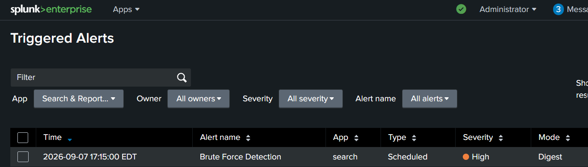
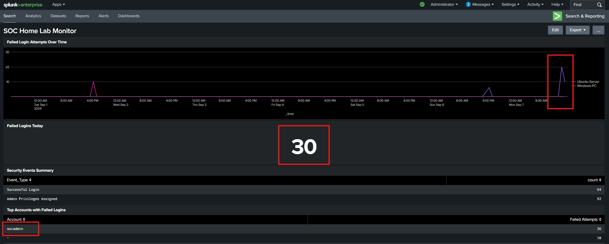

# 5. Attack Simulation

## Overview
Attack simulation is a critical part of validating a 
SOC environment. Building alerts and dashboards means 
nothing if they have not been tested against real attack 
activity. This section covers three simulated attacks 
performed from a Kali Linux machine against the lab 
environment — a brute force SSH attack against the 
Ubuntu Server, a port scan reconnaissance against the 
Ubuntu Server, and a brute force attack against the 
Windows PC.

Note: While the attacker perspective is briefly covered 
for context, the primary focus is on how each attack was 
detected, investigated, and analyzed from the defender's 
perspective using Splunk.

## Lab Setup

| Machine | Role | IP Address |
|---|---|---|
| Kali Linux | Attack machine | 10.0.0.140 |
| Ubuntu Server | Target / Splunk SIEM | 10.0.0.26 |
| Windows 11 PC | Monitored endpoint | 10.0.0.220 |

Both the Ubuntu Server and Windows PC were actively 
sending logs to Splunk during the simulation — meaning 
every attack action was being captured and available 
for investigation.

---

## Attack 1 - SSH Brute Force Against Ubuntu Server

### Attacker Side
A brute force attack was simulated using Hydra against 
the SSH service on the Ubuntu Server. A wordlist of 
10 common passwords was created on the Kali Linux machine and Hydra was configured 
to attempt each one in parallel.

Command used:

    hydra -l socadmin -P passwords.txt ssh://10.0.0.26 -t 4 -V

Command breakdown:
- hydra = the brute force tool
- -l socadmin = the username being targeted
- -P passwords.txt = the password wordlist
- ssh://10.0.0.26 = the target and protocol
- -t 4 = 4 parallel threads
- -V = verbose output showing each attempt

Hydra tried all 10 passwords within seconds. None 
matched the actual password so the attack was 
unsuccessful from the attacker's perspective.

### Defender Side

#### Initial Discovery
To manually find the brute force attempt the following 
search was run in Splunk:

    index=main sourcetype=linux_secure "Failed password"
    | table _time, host, _raw
    | sort -_time

This search looks at the Ubuntu Server's authentication 
log for any failed password entries. Setting the time 
range to Last 60 minutes and running the search revealed multiple failed SSH authentication events appearing in 
rapid succession — all originating from the same source 
IP address. The speed and volume of failures immediately 
indicated automated activity rather than a human 
mistyping a password.

#### Checking Triggered Alerts
After confirming suspicious activity in the logs 
Activity → Triggered Alerts was checked in Splunk. 
The brute force detection alert had fired and was 
waiting to be reviewed — confirming the detection 
logic worked correctly.

#### Dashboard Overview
The SOC monitoring dashboard was checked to get a 
broader picture of what was happening across the 
environment:

- Panel 1 showed a visible spike on the Ubuntu Server
  line indicating a sudden increase in failed logins
- Panel 2 showed an elevated failed login count for today
- Panel 4 showed the socadmin account at the top with
  the highest number of failed attempts

#### Breaking Down the Log Entries
